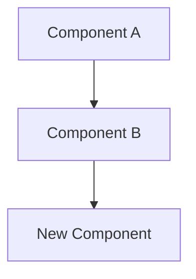

# Architecture Decision Record

Generate a numbered ADR before any structural or architectural change.

## Arguments
$ARGUMENTS — Brief title for the decision (e.g., "use-redis-for-caching", "switch-to-grpc")

## Instructions

1. **Find the next ADR number**: Look in `docs/adr/` for existing ADRs. If none exist, create the directory and start at `0001`.

2. **Create the ADR file**: `docs/adr/NNNN-<title>.md` using this template:

```markdown
# ADR-NNNN: <Title>

**Date**: <today>
**Status**: Proposed
**Deciders**: <team/author>

## Context

What is the issue that we're seeing that is motivating this decision or change?

## Decision

What is the change that we're proposing and/or doing?

## Alternatives Considered

| Alternative | Pros | Cons |
|-------------|------|------|
| Option A | ... | ... |
| Option B | ... | ... |

## Architecture Diagram



> Diagram should show: (1) components affected by this decision, (2) new components introduced, (3) data flow between them, (4) external dependencies. Use C4 conventions: `graph TD` for structure, `sequenceDiagram` for interactions.

## Consequences

### Positive
- ...

### Negative
- ...

### Risks
- ...

## Implementation Notes

- Migration steps (if applicable)
- Dependencies affected
- Testing strategy
- Rollback plan
```

3. **Fill in the template** based on the context provided in `$ARGUMENTS` and any relevant codebase context. Ask clarifying questions if the decision scope is unclear.

4. **Bridge to implementation**: After the ADR is written, suggest running `/spec` to plan the implementation if the decision involves code changes.

## Quality Checks
- ADR addresses a real architectural concern (not a trivial implementation detail)
- Alternatives section has at least 2 genuine options
- Consequences section is honest about trade-offs
- Implementation notes include a testing strategy
