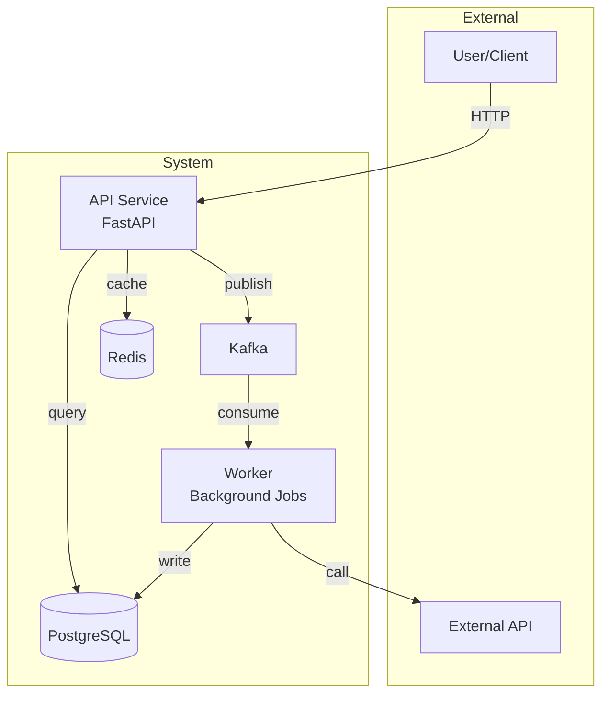
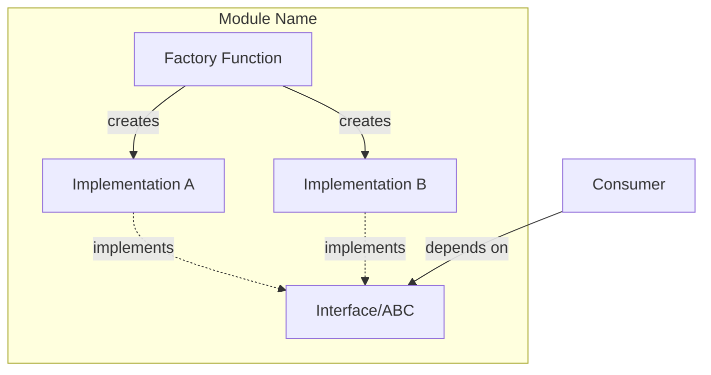
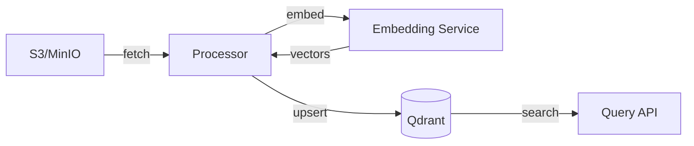
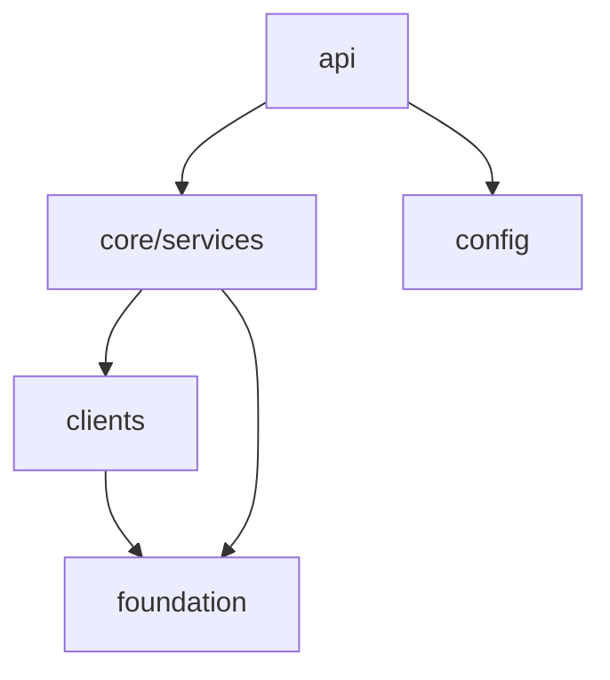

# Architecture Diagram Generator

Generate or update Mermaid architecture diagrams from codebase analysis.

## Arguments
$ARGUMENTS — Scope: "full" (whole system), a module/package name, "data-flow", "dependencies", or a specific component to focus on.

## Instructions

### 1. Determine Scope & Diagram Type

| Argument | Diagram Type | What to Show |
|----------|-------------|--------------|
| `full` or empty | C4 Container | All services, databases, external systems |
| Module/package name | C4 Component | Internal structure of that module |
| `data-flow` | Flowchart LR | Data pipeline from input to output |
| `dependencies` | Graph TD | Import/dependency graph between packages |
| `<component>` | Focused component | That component's interfaces and connections |

### 2. Explore Architecture

**Scan in this order:**
1. **Entry points**: `main.go`, `main.py`, `cmd/`, `src/api/`, `app.py`, `index.ts`
2. **Package structure**: `go.mod`, `pyproject.toml`, `package.json` — module boundaries
3. **Interfaces/ABCs**: Abstract base classes, interface definitions, protocol types
4. **Infrastructure**: Docker Compose, K8s manifests, Helm charts in `zarf/`, `deploy/`, `k8s/`
5. **Data stores**: Database clients, cache clients, message queue producers/consumers
6. **External integrations**: HTTP clients, gRPC stubs, SDK imports

**For each component, capture:**
- Name and responsibility (1 sentence)
- Inbound/outbound connections (protocol: HTTP, gRPC, async, direct import)
- Data stores it reads/writes
- External services it calls

### 3. Generate Mermaid Diagram

**C4 Container (full system):**


**C4 Component (single module):**


**Data Flow:**


**Dependency Graph:**


### 4. Conventions

- **Solid borders**: Existing components
- **Dashed borders**: New/proposed components (`style NewComponent stroke-dasharray: 5 5`)
- **Rectangles**: Services/applications
- **Cylinders `[()]`**: Databases/stores
- **Rounded `(())`**: External services
- **Solid arrows `-->`**: Synchronous calls
- **Dashed arrows `-.->` **: Async/event-driven
- **Arrow labels**: Protocol or action (`|HTTP|`, `|gRPC|`, `|publish|`)
- **Subgraphs**: Group by deployment boundary, layer, or namespace

### 5. Cross-Reference ADRs

Before generating the diagram, check for related ADRs:

1. Scan `docs/adr/` for existing ADRs
2. If any ADR relates to the scope being diagrammed, add a **References** section linking to it:
   ```markdown
   ## References
   - [ADR-NNNN: <title>](../../adr/NNNN-<title>.md)
   ```

### 6. Output

Save to `docs/spec/arch/` with descriptive filename:

| Scope | Filename |
|-------|----------|
| Full system | `docs/spec/arch/system-overview.md` |
| Module | `docs/spec/arch/<module>-components.md` |
| Data flow | `docs/spec/arch/data-flow.md` |
| Dependencies | `docs/spec/arch/dependency-graph.md` |

**File format:**
```markdown
# [Diagram Title]

Generated: [Date]

## Overview
[1-2 sentences about what this diagram shows]

## Diagram

```mermaid
[diagram here]
```

## Components

| Component | Responsibility | Tech |
|-----------|---------------|------|
| [Name] | [What it does] | [Language/framework] |

## Notes
- [Key architectural decisions]
- [Known coupling or debt]
```

### 7. Verify

- Diagram renders correctly (valid Mermaid syntax)
- All components identified in exploration appear in diagram
- Connections match actual import/call patterns (not assumptions)
- No orphan components (everything connects to something)

### 8. Pipeline: Next Step

After the diagram is saved, determine the next step in the architect → engineer pipeline.

Use AskUserQuestion:

```
question: "What's the next step?"
header: "Pipeline"
options:
  - "/rfp — Decompose into stories" - Break this architecture into implementable epics and stories
  - "/spec — Implement directly" - Plan and implement a specific change to this architecture
  - "Done — Diagram only" - No implementation action needed right now
```

Based on the user's choice, invoke the corresponding skill:
- `/rfp`: `Skill(skill='rfp', args='<epic description based on architecture scope>')` — creates an epic in `docs/spec/epics/`
- `/spec`: `Skill(skill='spec', args='<task description>')` — plans and implements directly
- Done: End the workflow

## Rules
- NEVER guess connections — verify by reading imports and client code
- NEVER include implementation details in container-level diagrams
- ALWAYS show data stores and external services as separate nodes
- Use subgraphs to show deployment boundaries (K8s namespaces, Docker networks)
