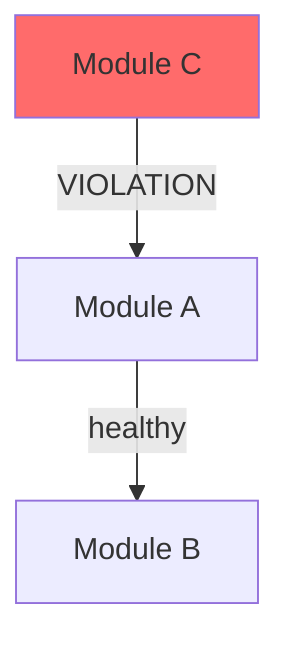

# Pattern Analysis

Analyze codebase for DRY violations, anti-patterns, reuse opportunities, and pattern consistency.

## Arguments
$ARGUMENTS — Optional: scope to analyze. Can be a directory, file, or keyword like "dry", "coupling", "complexity". Defaults to changed files.

## Instructions

### 1. Determine Scope

```
IF $ARGUMENTS is a directory or file:
    → Analyze that scope
ELIF $ARGUMENTS is a keyword ("dry", "coupling", "complexity"):
    → Run that specific analysis across the project
ELSE:
    → Analyze all uncommitted/staged changes
```

### 2. DRY Analysis — Duplicated Logic

Search for duplicated patterns across the scoped files:

**Techniques:**
- **Structural duplication**: Similar function bodies (>5 lines matching)
- **Semantic duplication**: Different code doing the same thing (e.g., multiple error formatters)
- **Copy-paste drift**: Near-identical blocks with 1-2 line differences (bug magnet)
- **Config duplication**: Same values hardcoded in multiple places

**Search approach:**
1. Identify all functions/methods in scope
2. Compare function bodies for structural similarity
3. Look for repeated patterns: error handling, validation, transformation
4. Check for constants that should be extracted

**Report format:**
```
### DRY Violations

| Location A | Location B | Similarity | Suggested Fix |
|-----------|-----------|-----------|--------------|
| `pkg/a.go:45` | `pkg/b.go:78` | 85% (12 lines) | Extract to `pkg/common.go:ParseConfig()` |
```

### 3. Pattern Consistency — Does New Code Follow Existing Patterns?

**Check these patterns against the codebase:**

| Pattern | What to Check |
|---------|--------------|
| Error handling | Same wrap style? Same error types? |
| Logging | Same logger? Same structured fields? |
| Configuration | Same config loading pattern? |
| Testing | Same fixtures? Same assertion style? |
| Naming | Same conventions (Get vs Fetch, Create vs New)? |
| Interfaces | Consumer-defined? Right size (1-3 methods)? |
| Constructor | Factory functions vs direct init? |

**For each inconsistency:**
```
### Pattern Inconsistency: [Category]

**Established pattern** (used in N files):
  `src/clients/qdrant.py:12` — `raise UpstreamError(...) from e`

**Deviation** (in changed code):
  `src/clients/new_client.py:45` — `raise Exception(...)`

**Fix**: Use `UpstreamError` to match existing error hierarchy.
```

### 4. Coupling Analysis — Unhealthy Dependencies

**Check for:**
- **Import cycles**: A imports B imports A
- **Layer violations**: API layer importing from foundation directly (skipping service)
- **God objects**: Single class/module imported by >10 other files
- **Feature envy**: Functions that use more of another module's data than their own
- **Shotgun surgery**: One change requiring edits in >5 files

**Visualization** (generate Mermaid):


### 5. Complexity Analysis

**Check for:**
- **Functions >50 lines**: Should be split
- **Nesting >4 levels**: Use early returns, guard clauses
- **Cyclomatic complexity >10**: Too many branches
- **Parameter lists >5 args**: Use a config struct/dataclass
- **Boolean parameters**: Replace with enum or separate functions
- **Long method chains without error checks** (Go)

### 6. Reuse Opportunities

**Identify extractable abstractions:**
- 3+ similar blocks → extract to helper function
- Repeated struct/dataclass shapes → extract to shared type
- Similar test setups → extract to fixture/helper
- Repeated validation logic → extract to validator

**Caution**: Only suggest abstractions where the pattern is stable and used 3+ times. Premature abstraction is worse than duplication.

### 7. Generate Report

```
## Pattern Analysis Report

**Scope**: <files/directory analyzed>
**Date**: <today>

### Summary

| Category | Issues | Severity |
|----------|--------|----------|
| DRY Violations | N | 🔴 High / 🟡 Medium / 🟢 Low |
| Pattern Inconsistencies | N | ... |
| Coupling Issues | N | ... |
| Complexity Hotspots | N | ... |
| Reuse Opportunities | N | ... |

### Critical (fix before merge)
1. ...

### Warning (fix soon)
1. ...

### Suggestion (improve when convenient)
1. ...

### Dependency Graph

```mermaid
[auto-generated from coupling analysis]
```

### Metrics

| Metric | Value | Threshold |
|--------|-------|-----------|
| Max function length | N lines | <50 |
| Max nesting depth | N | <4 |
| Duplicated blocks | N | 0 |
| Layer violations | N | 0 |
```

### 8. Offer Fixes

For each Critical and Warning finding, offer to fix automatically:

```
Question: "Found N pattern issues. Fix automatically?"
Header: "Fix"
Options:
- "Fix all" — Apply all suggested fixes
- "Review each" — Walk through one by one
- "Report only" — Just show the report, don't change code
```

## Rules
- NEVER suggest abstracting code used fewer than 3 times
- NEVER refactor working code without tests covering it first
- Prioritize by impact: bugs > maintenance burden > style
- DRY applies to logic, not to test setup (tests can be verbose)
- Pattern consistency matters more than personal preference
