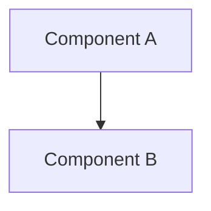

# RFP — Request for Proposal

Break an epic spec into implementation stories, or create/complete individual RFP stories.

## Arguments
$ARGUMENTS — One of:
- Epic spec path (e.g., `docs/spec/epic-05-data-model.md`) — decompose into stories
- Story number (e.g., `5.3`) — create or work on a specific RFP story
- `status` — show progress across all epics and stories

## Instructions

### 0. Determine Mode

```
IF $ARGUMENTS ends with ".md" AND contains "epic":
    → Mode: DECOMPOSE (break epic into stories)

ELIF $ARGUMENTS matches N.N pattern (e.g., "5.3"):
    → Mode: STORY (create or complete a single RFP story)

ELIF $ARGUMENTS == "status":
    → Mode: STATUS (report progress)

ELSE:
    → Mode: DECOMPOSE with new epic (create spec first, then decompose)
```

---

## Mode: DECOMPOSE — Epic → Stories

### Step 1: Read the Epic

Read the spec file. Extract:
- Epic number and title
- Summary and key changes
- Story count (if stories table exists)
- Architecture references

If the spec doesn't exist yet, create it at `docs/spec/epic-NN-<slug>.md` using the template below, then proceed.

### Step 2: Explore Affected Code

For each area mentioned in the epic:
1. Read current implementation files
2. Identify interfaces, types, and functions that will change
3. Note test files that need updating
4. Check for cross-cutting concerns (config, migrations, CI)

### Step 3: Decompose into Stories

Break the epic into independently deliverable stories. Each story should:
- Be completable in a single focused session
- Have clear acceptance criteria
- Touch 2-5 files max
- Be testable in isolation

**Numbering convention**: `<epic>.<story>` (e.g., Epic 5 → stories 5.1, 5.2, 5.3, ...)

**Ordering**: Dependencies first. Foundation → clients → services → API → tests → docs.

### Step 4: Write Story RFPs

For each story, create `docs/rfp/<epic>.<story>-<slug>.md`:

```markdown
[Back to Spec](../spec/epic-NN-<title>.md) | [Architecture Index](../architecture/README.md)

# Story <N.M> — <Title>

**Epic**: <N> — <Epic Title> **Points**: <1-5> **Status**: Todo

---

## Story

**As a** <role>, **I want** <capability>, **So that** <benefit>.

**Acceptance Criteria**:

- <Concrete, testable criterion>
- <Concrete, testable criterion>
- <Concrete, testable criterion>

**Testing**: >90% unit coverage. Tests:

- `test_<scenario_1>`
- `test_<scenario_2>`
- `test_<scenario_3>`

---

## Architecture References

- [ARCH-NNN-<name>.md](../architecture/ARCH-NNN-<name>.md)

---

## Architecture Diagram



---

## Checklist

### Coding Patterns (apply where appropriate)

- [ ] **Fluent Interface** — method chaining for readable configuration/setup
- [ ] **Builder Pattern** — complex object construction
- [ ] **DRY** — no duplicated logic; extract shared utilities
- [ ] **Decorator Pattern** — wrap behavior (retry, circuit breaker, logging)
- [ ] **Strategy Pattern** — interchangeable algorithms
- [ ] **Observer Pattern** — event-driven notifications
- [ ] **Singleton Pattern** — single instance resources
- [ ] **Facade Pattern** — simplified interface over complex subsystems

### Testing Requirements

- [ ] >90% unit test coverage
- [ ] Class-based test organization with descriptive names
- [ ] Every test has docstring: **Why important** + **What it tests**
- [ ] `conftest.py` fixtures (global + per-service)
- [ ] Edge cases covered and documented

### Documentation Requirements

- [ ] Module-level docstrings on all files
- [ ] Google-style docstrings on public functions
- [ ] Architecture diagram updated (if structural change)
```

### Step 5: Update Epic Spec

Update the epic's stories table with links to each RFP:

```markdown
## Stories

| #   | Story                        | File                                    |
| --- | ---------------------------- | --------------------------------------- |
| N.1 | <Story title>                | [N.1-slug.md](../rfp/N.1-slug.md)      |
| N.2 | <Story title>                | [N.2-slug.md](../rfp/N.2-slug.md)      |
```

Update status and points: `**Status**: In Progress **Stories**: N.1--N.M **Points**: <sum>`

### Step 6: Summary

Report what was created:
```
## RFP Decomposition Complete

**Epic**: <N> — <Title>
**Stories Created**: <count>
**Total Points**: <sum>

| # | Story | Points | Dependencies |
|---|-------|--------|-------------|
| N.1 | <title> | 2 | None |
| N.2 | <title> | 3 | N.1 |
| ... | ... | ... | ... |

Next: `/rfp N.1` to start implementing the first story
```

---

## Mode: STORY — Work on a Single RFP

### Step 1: Find the Story

Look for `docs/rfp/<number>-*.md`. Read it fully.

### Step 2: Check Status

- **Todo** → Implement via `/spec` workflow (bridge: `Skill(skill='spec', args='docs/rfp/<file>')`)
- **In Progress** → Continue implementation
- **Complete** → Move to ADR (see Step 4)

### Step 3: Implement

Bridge to the spec workflow for implementation:
```
Skill(skill='spec', args='docs/rfp/<epic>.<story>-<slug>.md')
```

The spec workflow handles planning, TDD, and verification.

### Step 4: Complete — Move to ADR

When all acceptance criteria are met and tests pass:

1. **Update RFP status**: `**Status**: Complete`
2. **Move file**: `docs/rfp/<N.M>-<slug>.md` → `docs/adr/<N.M>-<slug>.md`
3. **Update epic spec**: Change story link from `../rfp/` to `../adr/`
4. **Update epic status**: If all stories complete, set `**Status**: Complete`

```bash
mv docs/rfp/<N.M>-<slug>.md docs/adr/<N.M>-<slug>.md
```

Update back-link in the moved file: `[Back to Spec]` stays the same (relative path still works).

---

## Mode: STATUS — Progress Report

### Step 1: Scan All Epics

```bash
ls docs/spec/epic-*.md
```

### Step 2: For Each Epic, Count Stories

```bash
# Stories still in RFP (pending)
ls docs/rfp/<epic-num>.* 2>/dev/null | wc -l

# Stories moved to ADR (complete)
ls docs/adr/<epic-num>.* 2>/dev/null | wc -l
```

### Step 3: Generate Report

```
## Epic Status Report

| # | Epic | Total | Done | Remaining | Progress |
|---|------|-------|------|-----------|----------|
| 1 | Repository Restructure | 9 | 9 | 0 | ████████░░ 100% |
| 2 | Foundation Fault Tolerance | 8 | 5 | 3 | █████░░░░░ 63% |
| ... | ... | ... | ... | ... | ... |

**Overall**: X/Y stories complete (Z%)
```

---

## Epic Spec Template

For creating new epics (`docs/spec/epic-NN-<slug>.md`):

```markdown
# Epic <N> — <Title>

**Status**: Planning **Stories**: -- **Points**: --

## Summary

<2-3 sentences describing what this epic achieves and why>

## Architecture Diagram

```mermaid
graph TD
    %% Show the target architecture after this epic is complete
```

## Stories

| #   | Story | File |
| --- | ----- | ---- |
| N.1 | TBD   | --   |

## Key Changes

- <Bullet list of major changes>

## Dependencies

- <Other epics or external requirements>

## Risks

| Risk | Likelihood | Impact | Mitigation |
|------|-----------|--------|------------|
```

## Rules
- NEVER create stories without reading the affected code first
- NEVER skip the architecture diagram in story RFPs
- ALWAYS use the `<epic>.<story>` numbering convention
- Stories move rfp/ → adr/ on completion, never the reverse
- Points: 1=trivial, 2=small, 3=medium, 5=large (no 4 — force a decision)
