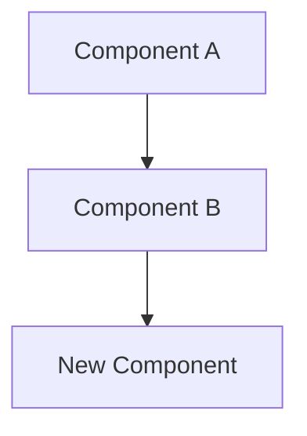

# ADR-NNNN: <Title>

**Date**: <today>
**Status**: Proposed
**Deciders**: <team/author>

## Context

What is the issue that we're seeing that is motivating this decision or change?

## Decision

What is the change that we're proposing and/or doing?

## Alternatives Considered

| Alternative | Pros | Cons |
|-------------|------|------|
| Option A    | ...  | ...  |
| Option B    | ...  | ...  |

## Architecture Diagram

> Diagram should show: (1) components affected by this decision, (2) new components introduced, (3) data flow between them, (4) external dependencies. Use C4 conventions: `graph TD` for structure, `sequenceDiagram` for interactions.

## Consequences

### Positive
- ...

### Negative
- ...

### Risks
- ...

## Implementation Notes

- Migration steps (if applicable)
- Dependencies affected
- Testing strategy
- Rollback plan

## Quality Checklist

### Architecture & Design

- [ ] ADR addresses a real architectural concern (not a trivial implementation detail)
- [ ] Alternatives section has at least 2 genuine options
- [ ] Consequences section is honest about trade-offs
- [ ] Implementation notes include a testing strategy
- [ ] Architecture diagram accurately reflects the change

### Coding Patterns (consider which apply to the decision)

- [ ] **Fluent Interface** — method chaining for readable configuration/setup
- [ ] **Builder Pattern** — complex object construction
- [ ] **DRY** — no duplicated logic; extract shared utilities
- [ ] **Decorator Pattern** — wrap behavior (retry, circuit breaker, logging)
- [ ] **Strategy Pattern** — interchangeable algorithms (e.g., error classifiers)
- [ ] **Observer Pattern** — event-driven notifications (e.g., metrics, logging hooks)
- [ ] **Singleton Pattern** — single instance resources (e.g., DB connections, model instances)
- [ ] **Facade Pattern** — simplified interface over complex subsystems

### Implementation Readiness

- [ ] Decision is clear enough for an implementer unfamiliar with the codebase
- [ ] Affected files/modules are identified
- [ ] Testing strategy covers unit, integration, and edge cases
- [ ] Rollback plan is defined (if applicable)
- [ ] Documentation requirements are identified
