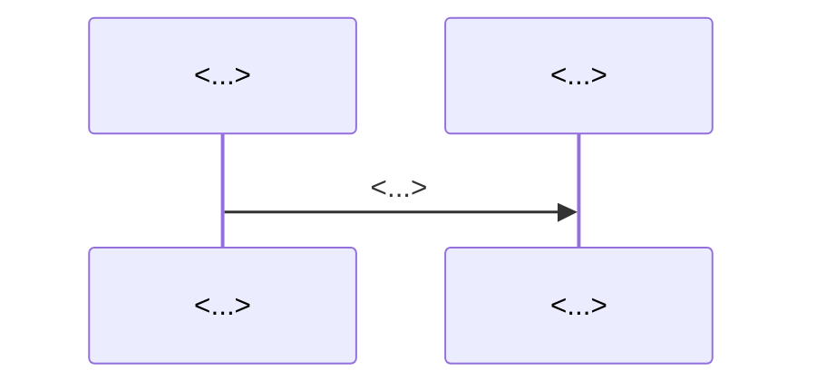

# <Feature / Subsystem> — Design

> **Scope:** <what this design covers, and explicit non-goals>.
> **Reflects:** the code as of <YYYY-MM-DD> (<relevant epics/stories>).
> **Governing:** ADR-<NNNN> (the decision), `docs/spec/arch/<slug>.md` (diagrams).

## TL;DR

<The end-state design in 3–6 numbered steps — the reader should grasp the whole
shape from this section alone.>

## Context & constraints

<Current state and the problem being solved. Hard constraints that bound the
solution (external contracts, security, correctness invariants, physics). Explicit
non-goals so scope is unambiguous.>

## The design



<Narrative, stage by stage: what drives each stage, where the seams/interfaces
are, what is config-selected (`Kind`/factory), what resiliency is built in, and
what is deliberately deferred.>

## State / data model

```
<FSM or schema, when the design has stateful entities — e.g. document status:
pending ─▶ processing ─▶ indexed / failed>
```

## Alternatives considered

| Option | Why not chosen |
| --- | --- |
| <alt> | <trade-off> |

## Open questions

- <unresolved decision that needs a ruling before/while building>

## References

- ADRs: <ADR-NNNN …> · Arch: `docs/spec/arch/<slug>.md` · Stories: <…>
