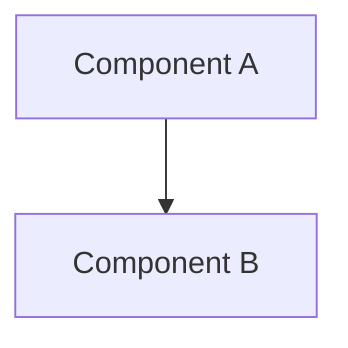

# Epic <N> — <Title>

**Status**: Planning **Stories**: -- **Points**: --

## Summary

<2-3 sentences describing what this epic achieves and why>

## Architecture Diagram

## Stories

| #   | Story         | File                               |
| --- | ------------- | ---------------------------------- |
| N.1 | <Story title> | [N.1-slug.md](../rfp/N.1-slug.md) |
| N.2 | <Story title> | [N.2-slug.md](../rfp/N.2-slug.md) |

## Key Changes

- <Major change or deliverable>
- <Major change or deliverable>

## Dependencies

- <Other epics or external requirements>

## Risks

| Risk     | Likelihood   | Impact       | Mitigation     |
| -------- | ------------ | ------------ | -------------- |
| [Risk 1] | Low/Med/High | Low/Med/High | [Mitigation 1] |
