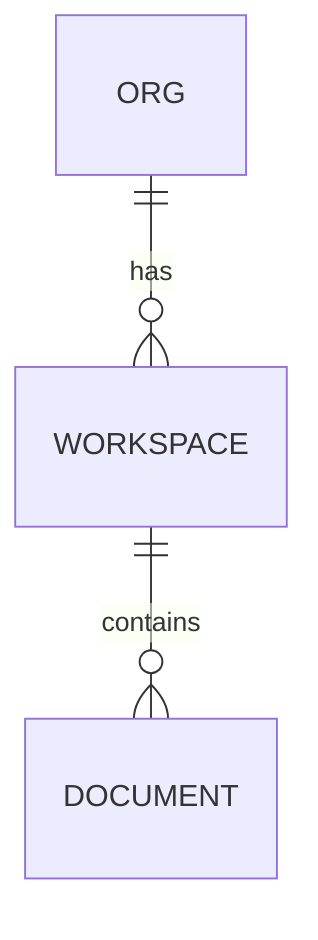

# <Epic name — e.g. "Workspace & team access">

> Linear **project / parent** template. Describe the outcome, not the tasks. Lead / target
> are Linear fields. An ERD or dependency graph earns its place here when the shape isn't
> obvious in prose — Linear renders Mermaid, so keep the diagram slot below if it helps and
> delete it if it doesn't.

## Background

<The outcome this epic delivers, in one or two sentences — the user or business capability,
not a task list — and why it matters now.>

## Scope

- **In:** <what this epic covers>
- **Out:** <explicitly excluded / non-goals>

## Diagram (optional — delete if unused)

<An epic's diagram shows *structure* — a **C4 Container** view of the topology, or an `erDiagram`
for the data model it adds (a dependency graph of the child stories also fits). Diagram guide:
`~/.claude/templates/linear/README.md`. Example — replace or remove:>

## Stories

<3–10 child issues, each independently shippable and testable.>

- [ ] <story title>
- [ ] <story title>

## Success Criteria

- [ ] Every child story shipped and verified against the running product, not just marked done
- [ ] <the user-visible outcome that proves the epic is complete>

## References

<design doc · ADR · related epics>
