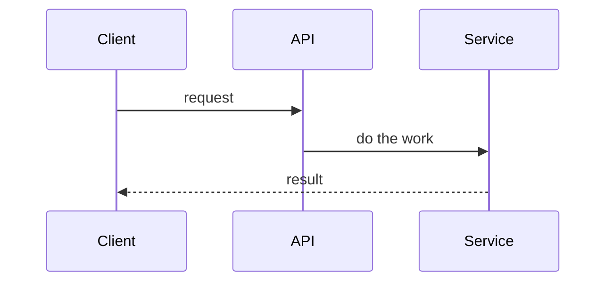

# <Verb-phrase title — e.g. "Add workspace CRUD & team access">

> Linear **story** template. Write it the way you'd brief a teammate, not a compiler.
> Estimate / priority / labels / assignee go in Linear's native fields — not the body.
> Linear renders Markdown, checklists, tables, images, Figma/Loom embeds, and **Mermaid**
> (`/diagram`, or a fenced ```mermaid block). Add a small diagram only when it clarifies.

## Background

<2–4 sentences: how it works today, the problem or opportunity, and why now. Link the
driving epic or design doc. This is the *why* — a reader should understand the point
before the requirements.>

## Requirements

<The *what*. Numbered so review comments and the acceptance criteria can reference them.>

1. <capability or behaviour to deliver>
2. <…>

## Design (optional — delete if unused)

<How it behaves — when a diagram earns it: a **sequence** for a cross-service or async flow, or a
**class** diagram for a new `core` interface + implementations + decorator. Diagram guide:
`~/.claude/rules/linear.md`. Delete this section for a simple CRUD/config story.>



## Acceptance Criteria

<Test conditions — observable and checkable. A one-character bug in the implementation
should fail at least one of these. Prefer Given / When / Then.>

- [ ] Given <state>, when <action>, then <observable result>
- [ ] <criterion>

## Out of Scope

- <explicitly not doing — the non-goals that keep this ticket bounded>

## References

<design doc · related issues (mention as @TEAM-123 to auto-link) · Figma · ADR>
