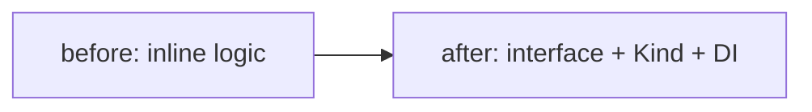

# <Title — e.g. "Migrate CI to the new runner image">

> Linear **task / chore / spike** template — engineering work that isn't a user story or a
> bug (infra, refactor, tooling, investigation). Keep it short; type and estimate are Linear fields.

## Background

<What this delivers and why now. For a spike: the question to answer and the timebox.>

## Requirements

1. <step or outcome>
2. <…>

## Diagram (optional — delete if unused)

<A task shows a *transformation* — a **before → after** flowchart/class for a refactor, an
**architecture** diagram for an infra target, or **flowchart steps / timeline** for a migration. A
spike carries none: its output diagram lands in a `/design-doc` or `/rca` doc — link it. Diagram guide:
`~/.claude/templates/linear/README.md`. Delete if unused.>

## Done When

- [ ] <observable completion — a passing gate, a merged refactor, or a written finding>

## References

<design / ADR / related issues>
