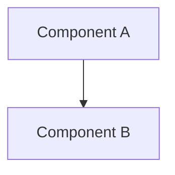

# [Feature Name] Implementation Plan

Created: [Date]
Status: PENDING
Approved: No
Iterations: 0
Worktree: Yes

> **Status Lifecycle:** PENDING → COMPLETE → VERIFIED
> **Iterations:** Tracks implement→verify cycles (incremented by verify phase)
>
> - PENDING: Initial state, awaiting implementation
> - COMPLETE: All tasks implemented
> - VERIFIED: All checks passed
>
> **Approval Gate:** Implementation CANNOT proceed until `Approved: Yes`
> **Worktree:** Set at plan creation (from dispatcher). `Yes` uses git worktree isolation; `No` works directly on current branch

## Summary

**Goal:** [One sentence describing what this builds]

**Architecture:** [2-3 sentences about chosen approach]

**Tech Stack:** [Key technologies/libraries]

## Architecture Diagram

> Show: affected components (solid border), new components (dashed border), data flow (arrows with labels), external services (rounded boxes). Update this diagram as implementation progresses.

## Scope

### In Scope

- [What WILL be changed/built]
- [Specific components affected]

### Out of Scope

- [What will NOT be changed]
- [Explicit boundaries]

## Prerequisites

- [Any requirements before starting]
- [Dependencies that must exist]
- [Environment setup needed]

## Context for Implementer

> This section is critical for cross-session continuity. Write it for an implementer who has never seen the codebase.

- **Patterns to follow:** [Reference existing file:line that demonstrates the pattern]
- **Conventions:** [Naming, file organization, error handling approach used in this project]
- **Key files:** [Important files the implementer must read first, with brief description of each]
- **Gotchas:** [Non-obvious dependencies, quirks, things that look wrong but are intentional]
- **Domain context:** [Business logic or domain concepts needed to understand the task]

## Runtime Environment (if applicable)

> Include this section when the project has a running service, API, or UI.
> Delete if the project is a library or CLI tool with no long-running process.

- **Start command:** [How to start the service]
- **Port:** [What port it listens on]
- **Deploy path:** [Where built artifacts are installed, if different from source]
- **Health check:** [How to verify the service is running]
- **Restart procedure:** [How to restart after code changes]

## Feature Inventory (FOR MIGRATION/REFACTORING ONLY)

> **Include this section when replacing existing code. Delete if not applicable.**

### Files Being Replaced

| Old File       | Functions/Classes      | Mapped to Task |
| -------------- | ---------------------- | -------------- |
| `old/file1.py` | `func_a()`, `func_b()` | Task 3         |
| `old/file2.py` | `ClassX`, `func_c()`   | Task 4, Task 5 |

### Feature Mapping Verification

- [ ] All old files listed above
- [ ] All functions/classes identified
- [ ] Every feature has a task number
- [ ] No features accidentally omitted

## Progress Tracking

**MANDATORY: Update this checklist as tasks complete. Change `[ ]` to `[x]`.**

- [ ] Task 1: [Brief summary]
- [ ] Task 2: [Brief summary]
- [ ] ...

**Total Tasks:** [Number] | **Completed:** 0 | **Remaining:** [Number]

## Implementation Tasks

### Task 1: [Component Name]

**Objective:** [1-2 sentences describing what to build]

**Dependencies:** [None | Task X, Task Y]

**Files:**

- Create: `exact/path/to/file`
- Modify: `exact/path/to/existing`
- Test: `tests/exact/path/to/test`

**Key Decisions / Notes:**

- [Technical approach or algorithm to use]
- [Which existing pattern to follow, with file:line reference]
- [Integration points with other tasks or existing code]

**Definition of Done:**

- [ ] All tests pass (unit, integration if applicable)
- [ ] No diagnostics errors (linting, type checking)
- [ ] [Task-specific criterion with observable outcome]
- [ ] [Task-specific criterion with observable outcome]

**Verify:**

- `<test-command> tests/path/to/test -q` — task-specific tests pass
- [Additional verification command or check]

### Task 2: [Component Name]

**Objective:** ...
**Dependencies:** Task 1
**Files:** ...
**Key Decisions / Notes:** ...
**Definition of Done:** ...
**Verify:** ...

## Testing Strategy

- Unit tests: [What to test in isolation]
- Integration tests: [What to test together]
- Manual verification: [Steps to verify manually]

## Risks and Mitigations

> Consider: breaking changes, backward compatibility, data loss/migration, performance regression, security implications, state management complexity, cross-component coupling, external dependency failures.

| Risk     | Likelihood   | Impact       | Mitigation                           |
| -------- | ------------ | ------------ | ------------------------------------ |
| [Risk 1] | Low/Med/High | Low/Med/High | [Concrete, implementable mitigation] |

## Open Questions

- [Any remaining questions for the user]
- [Decisions deferred to implementation]

### Deferred Ideas

- [Ideas surfaced during discussion that are out of scope for this plan]
