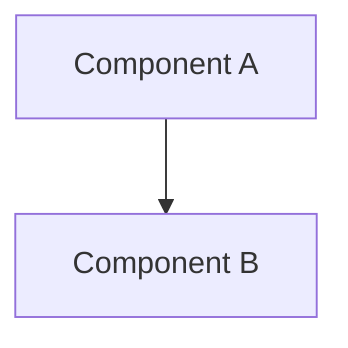

# Plan: [Title]

Type: Feature
Status: PENDING
Approved: No
Iteration: 1
Created: [Date]

> **The single plan format for `/spec`** — `spec-plan` and `spec-bugfix-plan` write every plan from this file to `docs/local/plans/YYYY-MM-DD-<slug>.md` (gitignored). Delete sections marked optional when they don't apply.
>
> - **Type:** `Feature` or `Bugfix` — the `/spec` dispatcher routes on it (plan/verify vs bugfix-plan/bugfix-verify).
> - **Status:** PENDING → COMPLETE → VERIFIED. PENDING: awaiting implementation · COMPLETE: all tasks implemented · VERIFIED: all checks passed.
> - **Approved:** implementation CANNOT start until `Approved: Yes` — plan approval is the only user checkpoint.
> - **Iteration:** starts at 1; the verify phase increments it each time it loops back to implement. The loop runs until VERIFIED.

## Summary

**Goal:** [One sentence describing what this builds or fixes]

**Architecture:** [2-3 sentences about chosen approach]

**Tech Stack:** [Key technologies/libraries]

## Goal Verification

> Observable truths that must hold once the goal is achieved — `spec-verify` and the reviewers check each one against the code. For a bugfix, the Behavior Contract's "must" clause is the first truth.

**Truths:**

- [ ] [Observable behavior, e.g. "POST /users with a duplicate email returns 409"]

**Artifacts:**

- [ ] `path/to/file` — [what it must contain; real, non-stub implementation]

## Bugfix (optional — `Type: Bugfix` only; delete for features)

**Source:** [RCA `docs/spec/rca/<slug>.md` · issue · user report]

**Behavior Contract:** Given [trigger/state], the code **did** [buggy behavior]; it **must** [correct behavior].

- Parallel implementations sharing the root cause: [call sites — fixed together, or why not]

**Root Cause:** [where and why the bug originates, with `file:line` evidence]

**Reproducing Test (specified here; written as Task 1's RED step after approval):**

- Path: `tests/...`
- Name: `test_<function>_<scenario>_<expected>`
- Tier / double: [unit — mocks `<boundary>` · integration — real `<service>` via testcontainers]
- Assertion: [the exact observable value/state that fails on current code and passes after the fix]

## Architecture Diagram


```mermaid
%% C4-style diagram showing components, data flow, and dependencies
%% Use graph TD for structure, sequenceDiagram for interactions,
%% flowchart LR for data pipelines
graph TD
    %% Replace with actual architecture
    A[Component A] --> B[Component B]
```

> Show: affected components (solid border), new components (dashed border), data flow (arrows with labels), external services (rounded boxes). Update this diagram as implementation progresses.

## Scope

### In Scope

- [What WILL be changed/built]
- [Specific components affected]

### Out of Scope

- [What will NOT be changed]
- [Explicit boundaries]

## Proposed Repository Structure

> **Include only when this plan creates new files.** Delete this section if nothing is added.

Show where new files land as a tree relative to the repo root; mark added paths `(new)` and changed paths `(modified)`. The layout MUST be consistent with the current repository structure and the project's language conventions — inspect the real tree first (`codegraph_files` / `ls`; the monorepo standard is `~/.claude/templates/repo.md`). If any new file requires a directory or layout that **deviates** from the current structure, STOP and ask the user to confirm before finalizing the plan.

```text
src/
├── <area>/
│   ├── <existing_file>        # modified
│   └── <new_file>             # (new)
└── tests/
    └── <area>/
        └── test_<new_file>    # (new)
```

- [ ] Matches the current repository layout
- [ ] Deviates from current layout — described above and **confirmed with the user** (note what/why)

## Prerequisites

- [Any requirements before starting]
- [Dependencies that must exist]
- [Environment setup needed]

## Context for Implementer

> This section is critical for cross-session continuity. Write it for an implementer who has never seen the codebase.

- **Patterns to follow:** [Reference existing file:line that demonstrates the pattern]
- **Conventions:** [Naming, file organization, error handling approach used in this project]
- **Key files:** [Important files the implementer must read first, with brief description of each]
- **Gotchas:** [Non-obvious dependencies, quirks, things that look wrong but are intentional]
- **Domain context:** [Business logic or domain concepts needed to understand the task]

## Runtime Environment (if applicable)

> Include this section when the project has a running service, API, or UI.
> Delete if the project is a library or CLI tool with no long-running process.

- **Start command:** [How to start the service]
- **Port:** [What port it listens on]
- **Deploy path:** [Where built artifacts are installed, if different from source]
- **Health check:** [How to verify the service is running]
- **Restart procedure:** [How to restart after code changes]

## Feature Inventory (FOR MIGRATION/REFACTORING ONLY)

> **Include this section when replacing existing code. Delete if not applicable.**

### Files Being Replaced

| Old File       | Functions/Classes      | Mapped to Task |
| -------------- | ---------------------- | -------------- |
| `old/file1.py` | `func_a()`, `func_b()` | Task 3         |
| `old/file2.py` | `ClassX`, `func_c()`   | Task 4, Task 5 |

### Feature Mapping Verification

- [ ] All old files listed above
- [ ] All functions/classes identified
- [ ] Every feature has a task number
- [ ] No features accidentally omitted

## Progress Tracking

**MANDATORY: Update this checklist the moment each task completes — change `[ ]` to `[x]`, Done +1, Left −1.**

- [ ] Task 1: [Brief summary]
- [ ] Task 2: [Brief summary]
- [ ] ...

**Total Tasks:** [Number] | **Done:** 0 | **Left:** [Number]

## Implementation Tasks

### Task 1: [Component Name]

**Objective:** [1-2 sentences describing what to build]

**Dependencies:** [None | Task X, Task Y]

**Files:**

- Create: `exact/path/to/file`
- Modify: `exact/path/to/existing`
- Test: `tests/exact/path/to/test`

**Key Decisions / Notes:**

- [Technical approach or algorithm to use]
- [Which existing pattern to follow, with file:line reference]
- [Integration points with other tasks or existing code]
- [`Why >2 test classes:` note, only if one production class genuinely needs more than 2 new test classes]

**Trivial:** [Optional — skip RED only if ≤ 5 net new production lines, no new branch/loop/try with a non-trivial body, no new public symbol, no new error path; name the existing covering test or verification command. Never for bugfixes. Audited against the diff at verify.]

**Definition of Done:**

- [ ] All tests pass (unit, integration if applicable)
- [ ] No diagnostics errors (linting, type checking)
- [ ] [Task-specific criterion with observable outcome]
- [ ] [Task-specific criterion with observable outcome]

**Verify:**

- `<test-command> tests/path/to/test -q` — task-specific tests pass
- [Additional verification command or check]

### Task 2: [Component Name]

**Objective:** ...
**Dependencies:** Task 1
**Files:** ...
**Key Decisions / Notes:** ...
**Definition of Done:** ...
**Verify:** ...

## Testing Strategy

> Declare the **tier** and the **double** for each area (see `~/.claude/rules/testing.md` *Test Double Policy — Two Tiers*). No fakes / in-memory substitutes.

- **Unit** (mock the boundary): [what to test in isolation; which external collaborators are mocked]
- **Integration** (real dependency in a Docker container via testcontainers, driven by fixtures): [what interaction to test; **name the image + module** — e.g. `postgres:16` via `testcontainers-go` / `testcontainers[postgres]` / `@testcontainers/postgresql`]
- **E2E / manual**: [steps to verify the running program]

## Risks and Mitigations

> Consider: breaking changes, backward compatibility, data loss/migration, performance regression, security implications, state management complexity, cross-component coupling, external dependency failures.

| Risk     | Likelihood   | Impact       | Mitigation                           |
| -------- | ------------ | ------------ | ------------------------------------ |
| [Risk 1] | Low/Med/High | Low/Med/High | [Concrete, implementable mitigation] |

## Open Questions

- [Any remaining questions for the user]
- [Decisions deferred to implementation]

### Deferred Ideas

- [Ideas surfaced during discussion that are out of scope for this plan]

## Deviations

> Added by `spec-implement` when it auto-fixes an inline bug / broken import, or stops on an architectural surprise. Delete if empty.

## References

- Story: `docs/spec/stories/N.M-<slug>.md` (its acceptance criteria are this plan's requirements; `spec-verify` marks it Complete)
- RCA: `docs/spec/rca/<slug>.md`
- ADR: `docs/adr/NNNN-<slug>.md`
- Design: `docs/spec/design/<slug>.md`
