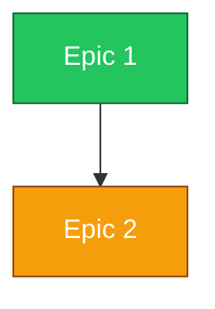

# <Program> — Roadmap

> **Date:** <YYYY-MM-DD> · **Horizon:** <phase / quarter / milestone set>

## At a glance

<Executive summary: what is shipped, what is in flight, what is next. Status is
cross-checked against code, not just epic/story `Status` fields (they drift).>

## Epic dependency map



## Phasing & parallelism

| Phase | Parallel tracks | Epics | Depends on |
|-------|-----------------|-------|------------|
| 0 | 1 | <epic> | — |
| 1 | <n> | <epics that unlock together> | <phase 0> |

## Critical path

```
Epic A → Epic B → Epic C → …
```

<What parallelizes against the critical path (frontend against stubs, infra from
day one, retrieval alongside ingestion).>

## Milestones

| Milestone | Scope | Gate (how we know it's done) |
|-----------|-------|------------------------------|
| <name> | <epics/stories> | <demo / audit / E2E> |

## Open risks & pending decisions

- <risk or un-accepted ADR blocking a track — link it>

## References

- Epics: `docs/spec/epics/` · Stories: `docs/spec/stories/` · ADRs: <…>
