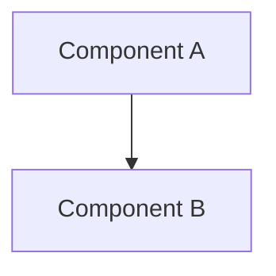

[Back to Spec](../spec/epic-NN-<title>.md)

# Story <N.M> — <Title>

**Epic**: <N> — <Epic Title> **Points**: <1-5> **Status**: Todo

---

## Story

**As a** <role>, **I want** <capability>, **So that** <benefit>.

**Acceptance Criteria**:

- <Concrete, testable criterion>
- <Concrete, testable criterion>
- <Concrete, testable criterion>

**Testing**: >90% unit coverage. Tests:

- `test_<scenario_1>`
- `test_<scenario_2>`
- `test_<scenario_3>`

---

## Architecture References

- [ARCH-NNN-<name>.md](../architecture/ARCH-NNN-<name>.md)

---

## Architecture Diagram

---

## Checklist

### Coding Patterns (apply where appropriate)

- [ ] **Fluent Interface** — method chaining for readable configuration/setup
- [ ] **Builder Pattern** — complex object construction
- [ ] **DRY** — no duplicated logic; extract shared utilities
- [ ] **Decorator Pattern** — wrap behavior (retry, circuit breaker, logging)
- [ ] **Strategy Pattern** — interchangeable algorithms (e.g., error classifiers)
- [ ] **Observer Pattern** — event-driven notifications (e.g., metrics, logging hooks)
- [ ] **Singleton Pattern** — single instance resources (e.g., DB connections, model instances)
- [ ] **Facade Pattern** — simplified interface over complex subsystems

### Testing Requirements

- [ ] >90% unit test coverage
- [ ] Organized test structure with descriptive names
- [ ] Every test documents: **Why important** + **What it tests**
- [ ] Shared test fixtures and helpers (see language standards)
- [ ] Edge cases covered and documented

### Documentation Requirements

- [ ] Module/package-level documentation on all files
- [ ] Public API documentation on classes, methods, and functions
- [ ] Inline comments for non-obvious logic only
- [ ] Type annotations on all public APIs
- [ ] Architecture diagram updated (if structural change)
- [ ] README in implementation directory (if new)

### Completion Workflow

- [ ] All checklist items above are satisfied
- [ ] Run project quality gates (format, lint, type check, tests)
- [ ] All quality gates pass
- [ ] Commit with conventional commit message
- [ ] Move story file from `docs/rfp/` to `docs/adr/`
- [ ] Update story status from "Todo" to "Done"
