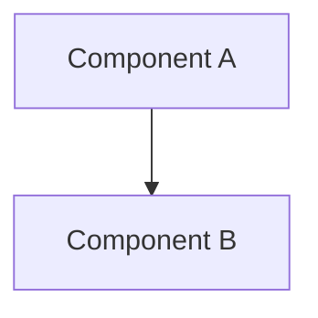

[Back to Epic](../epics/epic-NN-<title>.md)

# Story <N.M> — <Title>

**Epic**: <N> — <Epic Title> **Points**: <1-5> **Status**: Todo

---

## Story

**As a** <role>, **I want** <capability>, **So that** <benefit>.

**Acceptance Criteria**:

- <Concrete, testable criterion>
- <Concrete, testable criterion>
- <Concrete, testable criterion>

**Testing**: cover critical-path behavior (coverage is a diagnostic, not a quota — see testing.md). Tests:

- `test_<scenario_1>`
- `test_<scenario_2>`
- `test_<scenario_3>`

---

## Architecture References

- [ARCH-NNN-<name>.md](../arch/ARCH-NNN-<name>.md)

---

## Architecture Diagram


```mermaid
graph TD
    %% Show components affected by this story
    A[Component A] --> B[Component B]
```

---

## Proposed Repository Structure

> Fill in **only when this story creates new files.** Omit this section entirely if no files are added.

Show where new files land as a tree relative to the repo root; mark added paths `(new)` and changed paths `(modified)`. The layout MUST be consistent with the current repository structure and the project's language conventions — inspect the real tree first (`codegraph_files` / `ls`; the monorepo standard is `~/.claude/templates/repo.md`). If this story needs a directory or layout that **deviates** from the current structure, STOP and ask the user to confirm before finalizing the story.

```text
src/
├── <area>/
│   ├── <existing_file>        # modified
│   └── <new_file>             # (new)
└── tests/
    └── <area>/
        └── test_<new_file>    # (new)
```

- [ ] Matches the current repository layout
- [ ] Deviates from current layout — described above and **confirmed with the user** (note what/why)

---

## Checklist

### Coding Patterns (apply where appropriate)

- [ ] **Fluent Interface** — method chaining for readable configuration/setup
- [ ] **Builder Pattern** — complex object construction
- [ ] **DRY** — no duplicated logic; extract shared utilities
- [ ] **Decorator Pattern** — wrap behavior (retry, circuit breaker, logging)
- [ ] **Strategy Pattern** — interchangeable algorithms (e.g., error classifiers)
- [ ] **Observer Pattern** — event-driven notifications (e.g., metrics, logging hooks)
- [ ] **Singleton Pattern** — single instance resources (e.g., DB connections, model instances)
- [ ] **Facade Pattern** — simplified interface over complex subsystems

### Testing Requirements

- [ ] Critical-path behavior covered (no numeric quota — see testing.md)
- [ ] Organized test structure with descriptive names
- [ ] Every test documents: **Why important** + **What it tests**
- [ ] Shared test fixtures and helpers (see language standards)
- [ ] Edge cases covered and documented

### Documentation Requirements

- [ ] Module/package-level documentation on all files
- [ ] Public API documentation on classes, methods, and functions
- [ ] Inline comments for non-obvious logic only
- [ ] Type annotations on all public APIs
- [ ] Architecture diagram updated (if structural change)
- [ ] README in implementation directory (if new)

### Completion Workflow

- [ ] All checklist items above are satisfied
- [ ] Run project quality gates (format, lint, type check, tests)
- [ ] All quality gates pass
- [ ] Commit with conventional commit message
- [ ] Update story status from "Todo" to "Complete" (handled by `/spec-verify`)
